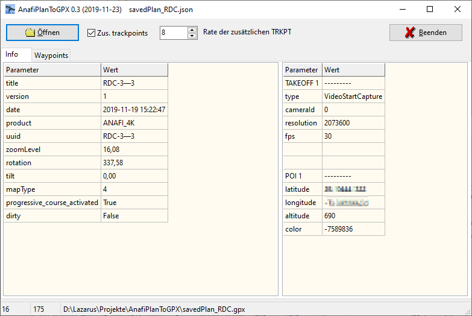
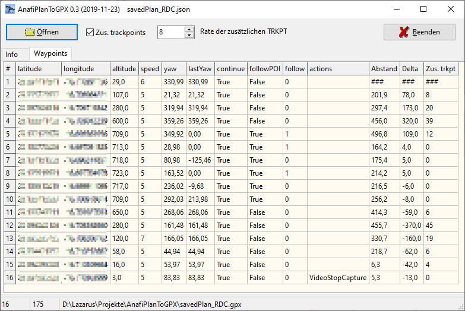

# AnafiPlanToGPX
Application to convert Parrot Anafi JSON flight plan files to GPX files for map services.

Info page shows meta data and multiple points like POI rfom the flight plan

GPX files will be automatically stored in the folder where the JSON flight plan is.

Waypoint pages shows the list of waypoints with additional columns:
- Distance: Distance between waypoints
- Delta: Delta altitude between waypoints (ascent/descent)
- Add. trkpt: Number additional trackpoints between Waypoints

F5 reloads the flight plan. Double click on related tables opens waypoints or POIs.
Hints will help you if mouse pointer hovers over a control.

Notes: 
- Additional trackpoints between waypoints will only be visible in the GPX file.
- It's not possible to edit waypoints or POIs with this application.
