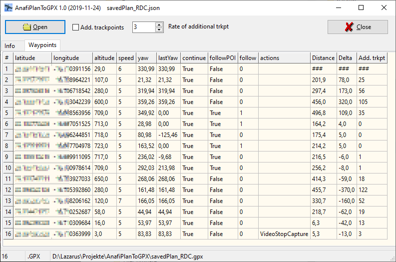

# AnafiPlanToGPX
Application to convert Parrot Anafi JSON flight plan files to GPX files for map services.

Info page shown meta data and multiple points like POI rfom the flight plan

Waypoint pages shows the list of waypoints with additional columns:
- Distance: Distance between waypoints
- Delta: Delta altitude between waypoints (ascent/descent)
- Add. trkpt: Number additional trackpoints between Waypoints

F5 reloads the flight plan. Double click on related tables opens waypoints or POIs.

Note: Additional trackpoints between waypoints will only be visible in the GPX file.
